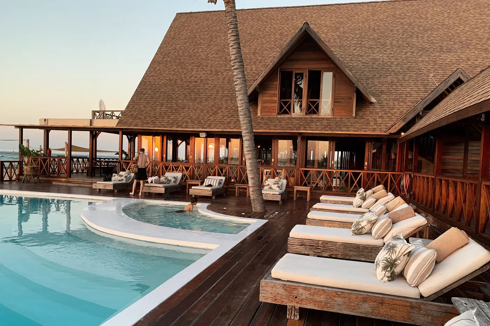

<div align="center">
  <br>
  <h1>ALX Listing App - Milestone 1: Scaffolding and Initial Setup for Listing Page </h1>
</div>

---



---

<br />

---
## Table of Contents

- [Table of Contents](#table-of-contents)
  - [Objectives](#objectives)
  - [Project Structure](#project-structure)
  - [Key Directories](#key-directories)
- [Getting Started](#getting-started)
  - [Prerequisites](#prerequisites)
  - [How to Run the Project Locally](#how-to-run-the-project-locally)
- [License](#license)


<br />

---

### Objectives
This project establishes a robust foundation for an Airbnb-style listing page. We're using Next.js, TypeScript for strong typing, and Tailwind CSS for styling. The setup is configured for clean code with ESLint, ensuring a scalable and maintainable codebase.


- Build a scalable and maintainable property listing application  
- Building responsive UIs with Tailwind CSS.  
- Ensure static type checking with TypeScript   
- Build with reusable components for consistency  
- Adopt best practices for Next.js and React development. 

<br />

<div align="right">

  [ [↑ to top ↑](#table-of-contents) ]
</div>

---

### Project Structure

```
alx-listing-app/
├── components/          # Reusable UI components
│   └── common/          # Common components used across the app
├── interfaces/          # TypeScript interfaces and types
├── constants/           # Application constants and configuration
├── pages/               # Next.js pages
├── public/              # Static files
│   └── assets/          # Images, icons, and other assets
└── styles/              # Global styles
```

<br />

<div align="right">

  [ [↑ to top ↑](#table-of-contents) ]
</div>

---

### Key Directories

- **`components/`**: Reusable React components for the UI.
  - **`common/`**: Contains foundational, project-wide components like `Card.tsx` and `Button.tsx`.
- **`interfaces/`**: TypeScript interfaces for type safety and code consistency across the project.
- **`constants/`**: Stores reusable data and strings, such as API URLs or configuration settings.
- **`public/assets/`**: Organizes static assets like images and SVGs.
- **`pages/`**: Next.js pages, where each file corresponds to a specific route.
- **`styles/`**: Global CSS styles.

<br />

<div align="right">

  [ [↑ to top ↑](#table-of-contents) ]
</div>

---

## Getting Started

### Prerequisites

- Node.js 16+ installed  
- npm or yarn package manager 
  
### How to Run the Project Locally

1. Clone the repository:

    ```bash
    git clone [repository-url]
    cd alx-listing-app
    ```

2.  **Install dependencies:**
    ```bash
    npm install
    # or
    yarn install
    ```
3.  **Run the development server:**
    ```bash
    npm run dev
    # or
    yarn dev
    # or
    pnpm dev
    # or
    bun dev
    ```
4.  **Open in browser:**
    Open [http://localhost:3000](http://localhost:3000) to view the application.

<br />

<div align="right">

  [ [↑ to top ↑](#table-of-contents) ]
</div>

---

## License

This project is part of the ALX Software Engineering program.

<br />

<div align="right">

  [ [↑ to top ↑](#table-of-contents) ]
</div>

---